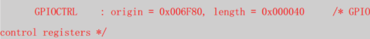
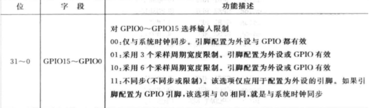
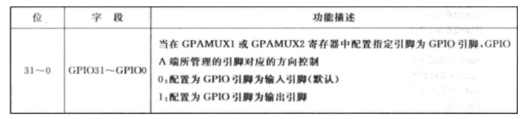
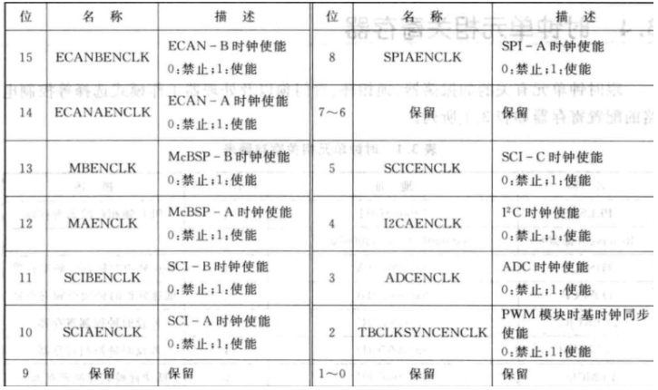
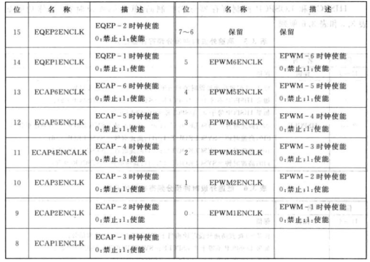
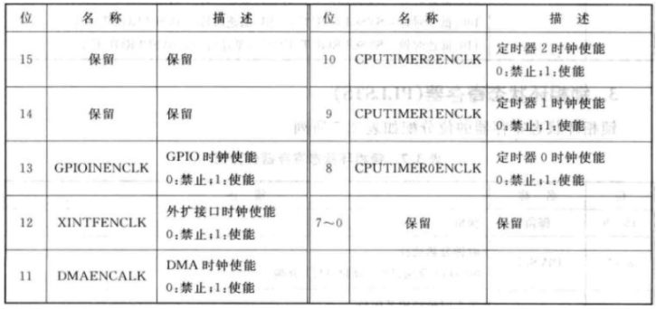
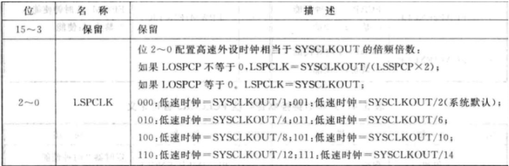
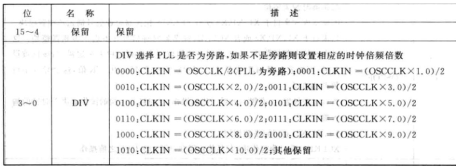

# 寄存器资料记录

## 一、IO控制寄存器

### Gpio控制寄存器

GpioCtrlRegs 是定义的 GPIO 控制寄存器

> 

GPIO管脚的分类：A0-31 B32-63 C64之后，其中对A、B、C进行操作的指令是类似的，这里给出GPIO 控制寄存器中定义的一些操作。

```c
struct GPIO_CTRL_REGS {
   union  GPACTRL_REG  GPACTRL;   // GPIO A Control Register (GPIO0 to 31)
   union  GPA1_REG     GPAQSEL1;  // GPIO A Qualifier Select 1 Register (GPIO0 to 15)
   union  GPA2_REG     GPAQSEL2;  // GPIO A Qualifier Select 2 Register (GPIO16 to 31)
   union  GPA1_REG     GPAMUX1;   // GPIO A Mux 1 Register (GPIO0 to 15)
   union  GPA2_REG     GPAMUX2;   // GPIO A Mux 2 Register (GPIO16 to 31)
   union  GPADAT_REG   GPADIR;    // GPIO A Direction Register (GPIO0 to 31)
   union  GPADAT_REG   GPAPUD;    // GPIO A Pull Up Disable Register (GPIO0 to 31)
   Uint32              rsvd1;
```

下面具体介绍每个寄存器的功能：

- GPxCTRL 寄存器:
  
  ```
  union  GPACTRL_REG  GPACTRL; //将为输入引脚指定采样周期， GPACTRL 为输入引脚 0-31 指定
  采样周期 
  union GPACTRL_REG {
     Uint32              all;
     struct GPACTRL_BITS bit;
  };
  //该结构体内又对每一位 IO 口进行了封装， 如 GPACTRL_BITS：
  struct GPACTRL_BITS {        // bits   description
     Uint16 QUALPRD0:8;        // 7:0    Qual period 
     Uint16 QUALPRD1:8;        // 15:8   Qual period 
     Uint16 QUALPRD2:8;        // 23:16  Qual period 
     Uint16 QUALPRD3:8;        // 31:24  Qual period  
  };
  ```

- GPAQSEL 寄存器
  
  GPAQSEL1 寄存器用来配置采样数， 也可以认为是滤波数， 当干扰信号持续采  
  样周期小于该寄存器设置的采样周期数时， 干扰信号被滤除， 该寄存器各位功能  
  如下,GPAQSEL2 寄存器用来对 GPIO31-16 来配置， 其配置方法一样。
  
  > 

- GPxDIR 寄存器
  
  GPxDIR 寄存器用来配置 GPIO 的输入输出方向， GPADIR 寄存器各位功能描述  
  如下所示：
  
  > 
  
  在复位时，引脚的默认状态为输入状态。
  
  如果GPxDIR.bit = 0，引脚设置为通用数字量输入；如果GPxDIR.bit = 1，引脚设置为通用数字量输出；
  
  复位时，GPxMUX和GPxDIR默认值都为0，所以在复位时，引脚的默认状态为数字I/O输入。

- GPxMUX 寄存器
  
  如果GPxMUX.bit = 0，配置成通用数字I/O功能；如果GPxMUX.bit = 1，配置成特殊外设功能口(如SCI、CAN)；
  
  GPAMUX1控制的是IO0-15口，GPAMUX2控制的是16-31口

```c
GpioCtrlRegs.GPCMUX1.bit.GPIO68=0;//语句的作用是将IO口68设置为通用GPIO功能
```

- GPxPU寄存器
  
  设置IO口的上拉电平，如果GPxPU.bit = 0，则能GPIO上拉电阻；如果GPxPU.bit = 1，则不使能。

```c
GpioCtrlRegs.GPCPUD.bit.GPIO68=0;//使能GPIO上拉电阻
```

### GPIO 数据寄存器 GPIO_DATA_REGS：

```c
struct GPIO_DATA_REGS {
   union  GPADAT_REG       GPADAT;       // GPIO Data Register (GPIO0 to 31)
   union  GPADAT_REG       GPASET;       // GPIO Data Set Register (GPIO0 to 31)
   union  GPADAT_REG       GPACLEAR;     // GPIO Data Clear Register (GPIO0 to 31)
   union  GPADAT_REG       GPATOGGLE;    // GPIO Data Toggle Register (GPIO0 to 31) 
```

下面具体介绍每个寄存器的功能：

- GPxDAT寄存器
  
  1)I/O为输出功能时，如果GPxDAT.bit = 0，那么操作将会使相应的引脚拉低；
  
  2)I/O口为输入功能时，如果GPxDAT.bit = 0，反映相应的引脚状态为低电平；
  
  3)I/O口为输出功能时，如果GPxDAT.bit = 1，那么操作将会使引脚拉高；
  
  4)I/O口为输入功能时，如果GPxDAT.bit = 1，反映相应的引脚状态为高电平。

- GPxSET寄存器(置位寄存器)
  
  是只写寄存器，任何读操作都返回0
  
  1)如果GPxSET.bit = 0，没有影响；
  
  2)引脚设置为输出时，如果GPxSET.bit = 1，那么操作将会使引脚置高。

- GPxCLEAR寄存器
  
  也是只写寄存器，任何读操作都返回0。
  
  1)如果GPxCLEAR.bit = 0，没有影响；
  
  2)引脚设置为输出时，如果GPxCLEAR.bit = 1，将相应的引脚置成低电平。

```c
GpioDataRegs.GPCCLEAR.bit.GPIO68=1;//设置 GPIO 输出低电平信号
```

- GPxTOGGLE寄存器
  
  是只写寄存器，任何读操作都返回0
  
  1)如果GPxTOGGLE.bit = 0，没有影响；
  
  2)引脚设置为输出时，如果GPxTOGGLE.bit = 1，那么操作将使相应的引脚取反。

## 二、时钟单元常用寄存器

### 1、外设时钟控制寄存器:PCLCCR0、PCLCCR1、PCLCCR3

- 外设时钟控制寄存器 PCLKCR0 各位定义
  
  > 

- 外设时钟控制寄存器 PCLKCR1 各位定义
  
  > 

- 外设时钟控制寄存器 PCLKCR3 各位定义
  
  > 

根据自己所使用的外设来使能或失能相应的时钟。 比如使能 GPIO 时钟， 其  
设置语句如下：

```c
SysCtrlRegs.PCLKCR3.bit.GPIOINENCLK = 1;
```

### 2、高/低速外设时钟预分频寄存器 HISPCP/LOSPCP

HISPCP 和 LOSPCP 控制寄存器分别控制高/低速的外设时钟， 具体功能描述如  
下所示：

- HISPCP 寄存器
  
  > 

- LOSPCP 寄存器
  
  > 

### 3、锁相环控制寄存器

锁相环控制寄存器用于控制芯片 PLL 的倍数， 在向 PLL 控制寄存器进行写操  
作之前， 需要具备以下两个条件。  
（1） 在 PLL 完全锁住后， 即 PLLSTS[PLLLOCKS]=1。  
（2） 芯片不能工作在 LIMP 模式， 即 PLLSTS[MCLKSTS]=0。

锁相环控制寄存器的具体功能描述如下：


其中分频数是除以 2 还是除以 4， 由锁相环状态寄存器的 DIVSEL 位控制， 上  
图为 DIVSEL 位为 10 情况， DIVSEL 位为 0 或 1 的时候进行 4 分频， 当 DIVSEL 位  
为 11 时进行 1 分频即不分频。

### 4、时钟初始化

```c
InitSysCtrl();//系统时钟初始化，默认已开启F28335所有外设时钟
// 这段函数的功能就是将系统控制寄存器初始化到想要的状态；
//具体步骤可以分成四部分：
// - 禁止看门狗电路
// - 给PLLCR寄存器赋值以获得想要的系统时钟频率
// - 给高、低速外设时钟预定标寄存器赋值以获得想要的高、低速外设时钟频率
// - 对需要使用的外设时钟进行使能
void InitSysCtrl(void)
{

   // Disable the watchdog
   DisableDog();

   // Initialize the PLL control: PLLCR and DIVSEL
   // DSP28_PLLCR and DSP28_DIVSEL are defined in DSP2833x_Examples.h
   InitPll(DSP28_PLLCR,DSP28_DIVSEL);

   // Initialize the peripheral clocks
   InitPeripheralClocks();
}
```

InitPll函数内主要实现了对 PLLCR 寄存器  的 DIV 及 PLLSTS 寄存器的 DIVSEL 位设置， 默认 DIV 值为 10， DIVSEL 值为 2，使用宏 DSP28_PLLCR 和 DSP28_DIVSEL 预先定义，可通过改变两个参数的值对系统时钟频率进行更改。

> 

# 三 、中断控制寄存器
